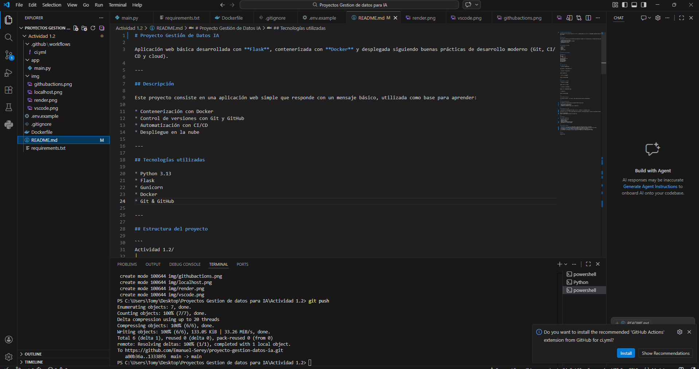
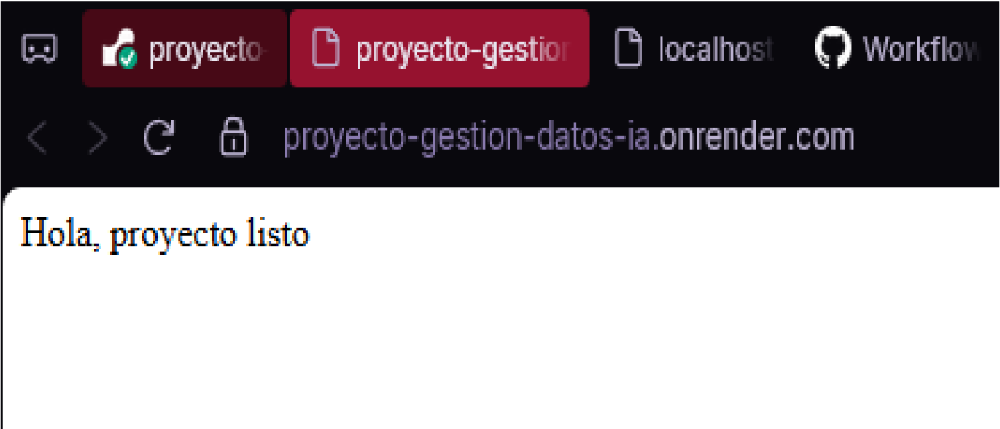
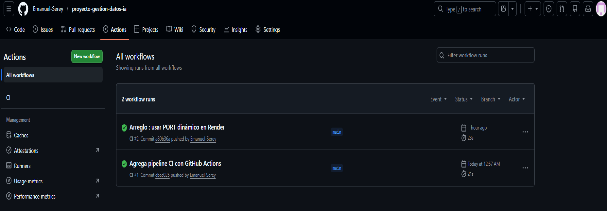
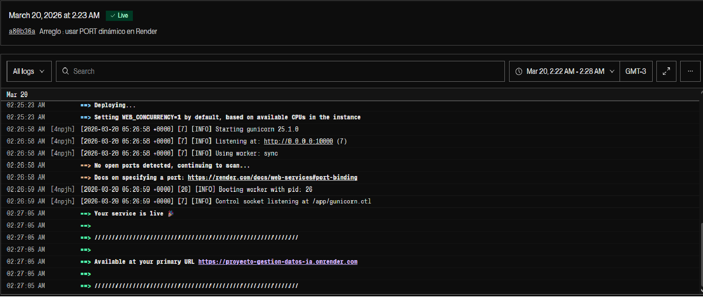

# Proyecto Gestión de Datos IA

Aplicación web básica desarrollada con **Flask**, contenerizada con **Docker** y desplegada siguiendo buenas prácticas de desarrollo moderno (Git, CI/CD y cloud).

---

## Descripción

Este proyecto consiste en una aplicación web simple que responde con un mensaje básico, utilizada como base para aprender:

* Contenerización con Docker
* Control de versiones con Git y GitHub
* Automatización con CI/CD
* Despliegue en la nube

---

## Tecnologías utilizadas

* Python 3.13
* Flask
* Gunicorn
* Docker
* Git & GitHub

---

## Estructura del proyecto

```
Actividad 1.2/
│
├── app/
│   └── main.py
│
├── img/
│   ├── vscode.png
│   ├── localhost.png
│   ├── githubactions.png
│   └── render.png
│
├── requirements.txt
├── Dockerfile
├── .gitignore
├── .env.example
└── README.md
```

---

##  Ejecución local

1. Instalar dependencias:

```
pip install -r requirements.txt
```

2. Ejecutar la aplicación:

```
python app/main.py
```

3. Abrir en navegador:

```
http://localhost:5000
```

---

## Ejecución con Docker

1. Construir la imagen:

```
docker build -t mi-app .
```

2. Ejecutar el contenedor:

```
docker run -p 5000:5000 mi-app
```

3. Acceder en:

```
http://localhost:5000
```

---

## Variables de entorno

Se incluye un archivo `.env.example` como referencia para futuras configuraciones.

---

## CI/CD (GitHub Actions)

Se implementó un pipeline básico utilizando GitHub Actions para:

* Build automático del proyecto
* Validación de dependencias
* Integración continua en cada push al repositorio

---

## Despliegue en la nube

La aplicación fue desplegada utilizando **Render**, mediante un contenedor Docker.

Se utilizó **Gunicorn** como servidor WSGI para producción, permitiendo manejar múltiples solicitudes de manera eficiente.

URL de la aplicación:
https://proyecto-gestion-datos-ia.onrender.com

---

## Evidencia

Se incluyen capturas de:

### Entorno de desarrollo


### Ejecución local


### CI/CD (GitHub Actions)


### Despliegue en la nube (Render)


---

## Decisiones técnicas

* Se utiliza **Flask** por su simplicidad y rapidez para desarrollar APIs y prototipos.
* **Gunicorn** fue elegido como servidor de producción en lugar del servidor de desarrollo de Flask.
* Se utilizó **Docker** para asegurar portabilidad y consistencia del entorno.
* Se implementó **CI/CD con GitHub Actions** para automatizar el proceso de integración.
* Se configuró correctamente el puerto requerido por Render para el despliegue en la nube.

---

## Autor

Emanuel Serey
